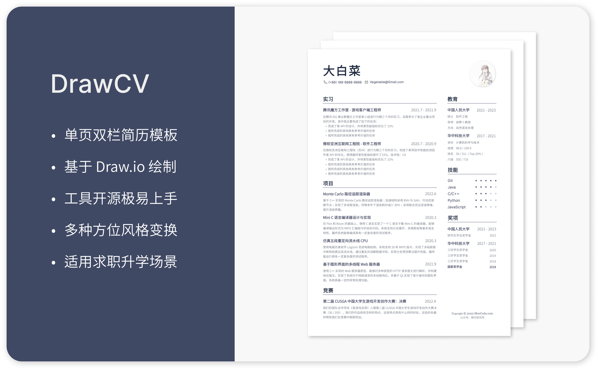
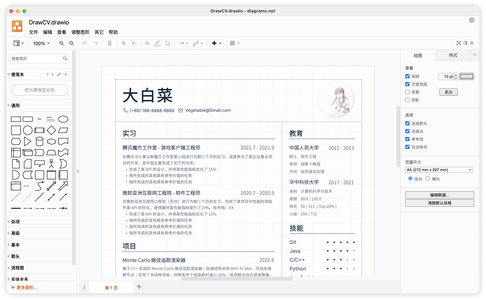
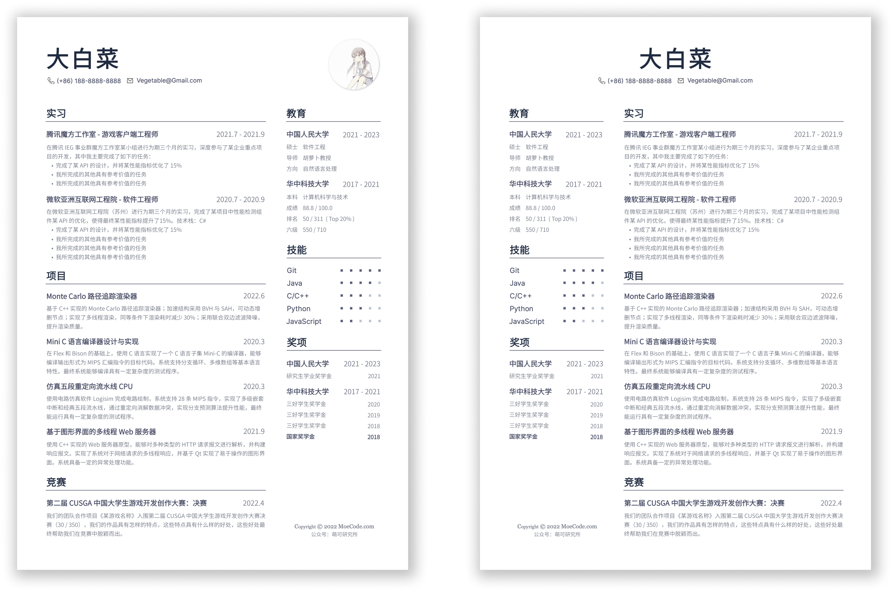
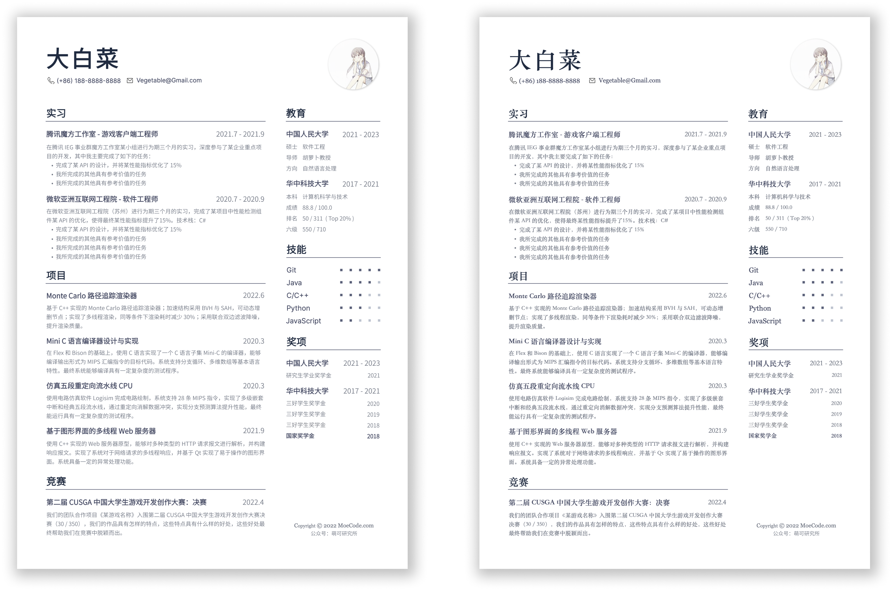
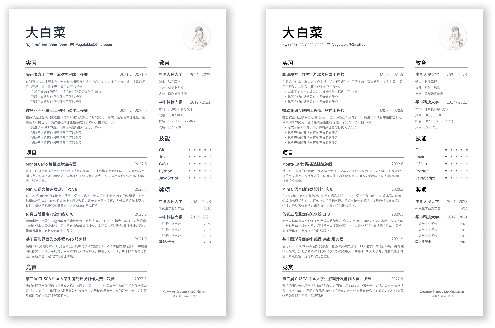
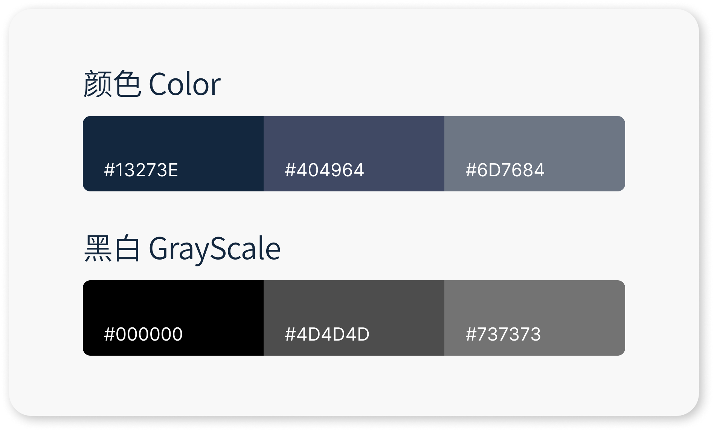
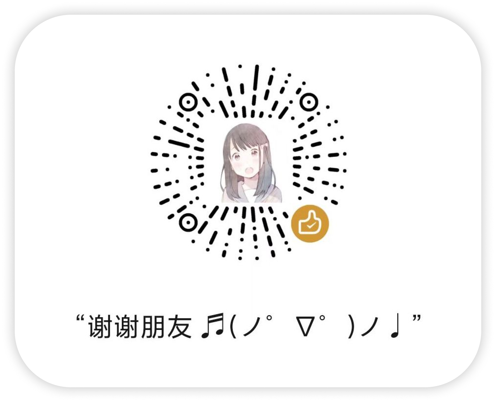

<h1 align="center">
  
   
  DrawCV
</h1>

Awesome CV template based on <a href="https://draw.io/">Draw.io</a>  基于 <a href="https://draw.io/">Draw.io</a> 绘制的简历模板

  
  
  
  

- [简介](#简介)
- [特性](#特性)
- [说明](#说明)
- [致谢与支持](#致谢与支持)

## 简介

## 特性

- 基于开源绘图工具 [Draw.io](https://draw.io/) 绘制，所见即所得的拖拽式排版，会画 PPT 就能修改本模板

  

- 可自由调整方位构建不同风格简历，模板提供标题「左对齐（带头像）」和「居中（不带头像）」两种版式

  

- 简历排版整齐划一（右：使用缩进区分层级影响美观）

  

- 全面拥抱无衬线字体（右：衬线字体细节繁多容易带来疲劳感）

  

- 采用更加柔和的配色方案（右：纯黑白配色单调乏味）

  

## 说明

- 阿里云盘[下载链接](https://www.aliyundrive.com/s/nGSmDSe4zT1)，提取码`w31g`

- 模板源文件在目录`source`下：

  - 左对齐版式：`DrawCV.drawio`

  - 居中版式：`Middle.drawio`

  - 【不推荐】其他用来对比效果的版式：`Indent.drawio`，`Serif.drawio`，`Gray.drawio`

- 推荐使用 [Draw.io 桌面版](https://www.diagrams.net/) 进行编辑

  - 模板带有辅助定位的线框，导出 PDF 前请删去线框

  - 请在“页面视图”模式下导出 PDF，否则可能造成页边距的缺失

- 模板设计时填充的示例分类适用于计算机类本科生求职，其他群体可适当修改，例如：

  - 面向升学的简历可添加核心课程成绩

  - 研究生简历可添加科研成果列表

- 本简历模板无衬线字体保存在目录`font`下，请保证系统已安装相关字体

  - 中文无衬线字体：思源黑体

  - 英文无衬线字体：Inter

- 本简历模板采用的配色方案，推荐使用上方柔和配色

  

## 致谢与支持

感谢设计师 [@Dott](https://dott.love)（公众号：Dott自留地）与技术美术 [@Fan]() 对本简历提供的建设性意见。

模板由 [@Zilize](https://moecode.com)（公众号：萌可研究所）出品，一位热爱图形学的二次元技术宅。

请我和两位大佬喝咖啡（微信赞赏码）：

